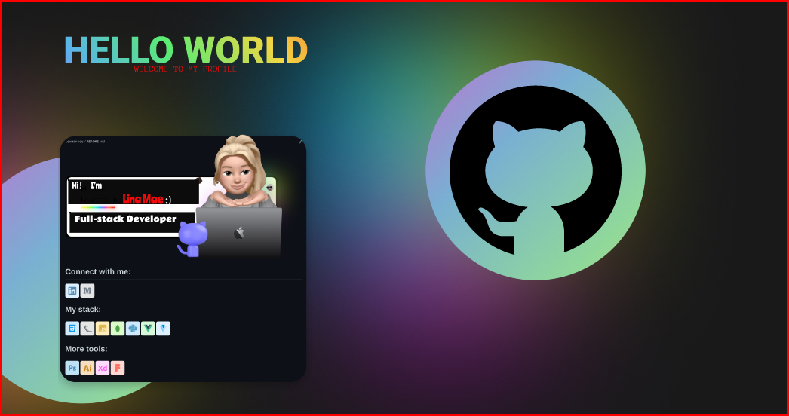

<h2 align="center">Hi 👋! Lina Mae here. :) </h2>

# 💫 About Me:
I always want to try my hand at a dynamic, young, and creative working environment. I have basic experience in communicating with costumers, and my skills in handling situations as well as management are relatively stable. 

# 💻 Tech Stack:
                                  
# 📊 GitHub Stats:
 
 

## 🏆 GitHub Trophies

### ✍️ Random Dev Quote

### 🔝 Top Contributed Repo

---

<!-- Proudly created with GPRM ( https://gprm.itsvg.in ) -->

###

  
  
  
  
  
  

###

 

###

